# mcp-breaker

[](LICENSE)
[](https://go.dev/)
[](https://github.com/shunvel/mcp-breaker/actions/workflows/ci.yml)

**Semantic MCP Circuit Breaker** — an open-source, zero-dependency JSON-RPC proxy that sits between AI clients and [Model Context Protocol (MCP)](https://modelcontextprotocol.io/) servers. It detects tool invocation loops early and intervenes gracefully before they drain API credits and flood agent context windows.

> Repository: [github.com/shunvel/mcp-breaker](https://github.com/shunvel/mcp-breaker)

---

## Table of Contents

- [Problem Statement](#problem-statement)
- [How mcp-breaker differs from alternatives](#how-mcp-breaker-differs-from-alternatives)
- [Solution](#solution)
- [Architecture](#architecture)
- [Features](#features)
- [Requirements](#requirements)
- [Installation](#installation)
- [Quick Start](#quick-start)
- [CLI Reference](#cli-reference)
- [Client Configuration](#client-configuration)
- [What happens when a detector trips](#what-happens-when-a-detector-trips)
- [How the Echo Breaker Works](#how-the-echo-breaker-works)
- [Project Structure](#project-structure)
- [Development](#development)
- [Test evidence](#test-evidence)
- [Roadmap](#roadmap)
- [License](#license)

---

## Problem Statement

Autonomous AI agents using MCP frequently hit **semantic stagnation loops**. Unlike traditional code loops that crash or throw exceptions, an agent logic loop returns successful responses on every turn. The agent appears to run correctly from an engineering standpoint, but its reasoning is locked in a recursive pattern:

- Executing the same terminal command repeatedly (`npm run test`, `go build`, …)
- Rewriting files with synonymous or cosmetic changes
- Calling identical tool parameters with no new outcomes

### Why existing guardrails fail

| Pain point | Description |
|------------|-------------|
| **Late triggers** | Numeric limits (`max_turns = 20`) fire too late. By then, API credits are spent and the context window is full of repetitive logs. |
| **Context degradation** | Short-term memory fills with low-signal responses, preventing the agent from breaking free on its own. |
| **Hard aborts** | Many tools terminate the session entirely instead of redirecting the agent toward a different strategy. |

---

## How mcp-breaker differs from alternatives

Most reliability tools were built for traditional web APIs or are locked inside heavy AI frameworks. They were not designed for MCP stdio transport, where tool calls look successful even when the agent is stuck.

### Versus traditional circuit breakers (Opossum, pybreaker)

- Generic breakers monitor HTTP status codes or process exit codes. An MCP session can stay healthy at the transport layer while `tools/call` responses repeat the same failure inside JSON-RPC payloads.
- **mcp-breaker is protocol-aware.** It inspects MCP `tools/call` requests and tool result bodies — including semantic similarity across paraphrased errors — not just whether the pipe is still open.

### Versus monolithic AI frameworks (SDK-bound breakers)

- Framework-level breakers require adopting a specific orchestrator, SDK, or runtime.
- **mcp-breaker is standalone and client-agnostic.** One binary sits between any MCP host (Cursor, Claude Desktop, Cline, etc.) and any child server (`npx`, `node`, `python`, `./fakemcp`, …). No application code changes — only the wrap command in your MCP config.

### Versus cloud API gateways (AWS API Gateway, reverse proxies)

- Cloud gateways protect backend infrastructure. They do not understand agent tool loops: a gateway may return a timeout while the LLM keeps retrying the same tool strategy and burning tokens on every turn.
- **mcp-breaker operates at the MCP proxy layer.** It trips within 2–3 iterations, blocks or annotates repetitive `tools/call` traffic, and returns deterministic intervention text so the model can pivot instead of filling context with duplicate logs.

### Feature matrix

| Capability | Generic breakers | Framework-bound breakers | Cloud gateways | mcp-breaker |
|------------|------------------|--------------------------|----------------|-------------|
| MCP protocol awareness | No | Partial | No | **Yes** |
| Client / framework agnostic | Yes | No | Yes | **Yes** |
| LLM token loop prevention | No | Partial | No | **Yes** |
| Zero infrastructure setup | Yes | No | No | **Yes** (single binary, stdio wrap) |

---

## Solution

mcp-breaker addresses stagnation loops by intercepting MCP traffic at the transport layer, flagging them within **2–3 iterations**, and returning structured interventions without killing the active chat session.

mcp-breaker runs as a transparent stdio proxy between your AI client (Cursor, Claude Desktop, Cline, etc.) and any MCP server. It monitors `tools/call` JSON-RPC frames, detects repetitive invocations, and either forwards the request or returns a synthetic intervention response.

```
+-----------+    JSON-RPC (stdio)      +-----------------+    Proxied Call    +------------+
| AI Client | ───────────────────────> |   mcp-breaker   | ─────────────────> | MCP Server |
|  (Cursor) | <─────────────────────── |  (Proxy Layer)  | <───────────────── |  (Target)  |
+-----------+    System Intervention   +-----------------+    Tool Response   +------------+
                          │
                          ▼
                 +-----------------+
                 |  Echo Detector  |
                 |  (hash ring)    |
                 +-----------------+
```

No MCP server needs to be running beforehand. The proxy **launches the child server** on each session via `wrap`.

Wire format follows the official [MCP stdio transport specification](https://modelcontextprotocol.io/specification/2026-07-28/basic/transports/stdio): one JSON-RPC object per line, logs on stderr only.

---

## Features

### Implemented

| Module | Description |
|--------|-------------|
| **Stdio JSON-RPC proxy** | Newline-delimited framing, bidirectional streaming, malformed frame recovery |
| **Tool echo detector** | Per-tool hash ring (last 5 calls); trips on the 3rd consecutive identical `tools/call` |
| **Semantic stagnation tracker** | Embedding cosine similarity (N vs N−2) ≥ 0.88 on tool results; spec Test Case B |
| **Sliding-window graph ledger** | Detects A→B→A→B loops; blocks and pauses until dashboard resume |
| **TUI dashboard** | `mcp-breaker dashboard` — live stream, metrics, cosine scores, resume control |
| **Model management** | `mcp-breaker models download|status` for All-MiniLM-L6-v2 ONNX cache |
| **Homebrew formula** | [`Formula/mcp-breaker.rb`](Formula/mcp-breaker.rb) — see [install guide](docs/install/homebrew.md) |
| **Graceful intervention** | Returns MCP `isError` results instead of crashing the session |
| **Built-in test server** | `fakemcp` for local demos with zero external dependencies |

### Planned

| Module | Description |
|--------|-------------|
| **Config auto-wrap (`init`)** | Rewrites Cursor / Claude Desktop MCP configs automatically |
| **Full ONNX embed pipeline** | `-tags=onnx` build with in-process All-MiniLM inference (stub today) |

See [spec.md](spec.md) for the full product specification.

---

## Requirements

- **Go 1.24+** — [go.dev/dl](https://go.dev/dl/)
- **macOS / Linux** — stdio proxy (Windows support planned)
- **Optional:** Node.js + `npx` — only if wrapping npm-based MCP servers
- **Optional:** `onnxruntime` + `mcp-breaker models download` — for semantic tracker (or `MCP_BREAKER_MOCK_EMBED=1` for dev)

---

## Installation

### Prebuilt binaries (recommended)

Download a release for your platform — no Go required:

**[GitHub Releases](https://github.com/shunvel/mcp-breaker/releases)** · macOS (arm64/amd64) · Linux · Windows

```bash
# macOS Apple Silicon example
curl -LO https://github.com/shunvel/mcp-breaker/releases/download/v0.2.0/mcp-breaker_0.2.0_darwin_arm64.tar.gz
tar xzf mcp-breaker_0.2.0_darwin_arm64.tar.gz
sudo mv mcp-breaker /usr/local/bin/
```

See [docs/install/releases.md](docs/install/releases.md) for all platforms and checksum verification.

### go install (Go 1.24+)

```bash
go install github.com/shunvel/mcp-breaker/cmd/mcp-breaker@latest
```

Binary installs to `$GOBIN` or `$GOPATH/bin`.

### From source

```bash
git clone https://github.com/shunvel/mcp-breaker.git
cd mcp-breaker
make build
```

This produces a single static binary at `./mcp-breaker`.

### Homebrew (macOS)

```bash
brew tap shunvel/mcp-breaker https://github.com/shunvel/mcp-breaker
brew install mcp-breaker
mcp-breaker models download   # optional: semantic model cache
```

For production semantic tracking, also install `onnxruntime` (`brew install onnxruntime`) or use `MCP_BREAKER_MOCK_EMBED=1` for development.

See [docs/install/homebrew.md](docs/install/homebrew.md) for ONNX configuration.

### Verify the build

```bash
make test    # run the full test suite
make validate # run all core flows: tests, echo, semantic, graph ledger
make vet     # static analysis
./mcp-breaker help
```

---

## Quick Start

### Option 1 — Local demo (no MCP config required)

The repo ships with a fake MCP server for testing. No Cursor setup, no running servers:

```bash
make demo
```

Expected output:

```
id=1: initialize -> testmcp
id=2: [forwarded] ok
id=3: [forwarded] ok
id=4: [BLOCKED] Error: Command [write_file] generated identical failures...
```

### Option 2 — Wrap a real MCP server

```bash
./mcp-breaker wrap -- npx -y @modelcontextprotocol/server-filesystem /tmp
```

The proxy starts the child process, forwards stdin/stdout, and monitors every `tools/call`.

### Option 3 — Wrap the built-in test server

```bash
go build -o fakemcp ./internal/testmcp/cmd/fakemcp
./mcp-breaker wrap -- ./fakemcp
```

### Option 4 — Dashboard + wrap

```bash
# Terminal 1
./mcp-breaker wrap -- ./fakemcp

# Terminal 2
./mcp-breaker dashboard
```

Press **R** in the dashboard to resume after a graph loop pause.

### Option 5 — Streamlit dev lab (browser)

Run the interactive test lab in one window — no Cursor config required:

```bash
make build && go build -o fakemcp ./internal/testmcp/cmd/fakemcp
make dev-ui   # http://localhost:8501
```

Flow: **Start proxy** → pick a scenario (Echo, Graph, Semantic) → **Run test** → scroll for results and live dashboard metrics.

For the **Semantic stagnation** test, enable **Mock semantic embedder** in the sidebar Settings.

---

## CLI Reference

```
mcp-breaker — semantic MCP circuit breaker proxy

Usage:
  mcp-breaker wrap [flags] -- <command> [args...]
  mcp-breaker dashboard
  mcp-breaker models download|status
  mcp-breaker help

Commands:
  wrap       Launch child MCP server through the circuit breaker stack
  dashboard  Terminal UI for live metrics and loop alerts
  models     Download or inspect ONNX embedding model cache
  help       Show usage information
```

### `wrap`

```bash
mcp-breaker wrap [--no-semantic] [--semantic-threshold=0.88] -- <command> [args...]
```

| Flag / argument | Description |
|-----------------|-------------|
| `--` | Required separator. Everything after `--` is passed to the child process verbatim. |
| `--no-semantic` | Disable semantic stagnation detector |
| `--semantic-threshold` | Cosine similarity trip threshold (default 0.88) |
| `<command>` | The MCP server executable (e.g. `npx`, `node`, `./fakemcp`). |
| `[args...]` | Arguments for the child server. |

**Behavior:**

- Reads JSON-RPC frames from **stdin** (the AI client), writes responses to **stdout**
- Forwards child **stderr** to the proxy's stderr (never stdout — that would break framing)
- Closes the child when the client disconnects
- Handles `SIGINT` / `SIGTERM` for clean shutdown

**Example — filesystem MCP server:**

```bash
mcp-breaker wrap -- npx -y @modelcontextprotocol/server-filesystem /Users/you/projects
```

**Example — custom Node server:**

```bash
mcp-breaker wrap -- node /path/to/my_mcp_server.js
```

---

## Client Configuration

Replace the MCP server command in your client config with `mcp-breaker wrap -- …`.

### Cursor

Edit your MCP settings (Settings → MCP, or `~/.cursor/mcp.json`):

```json
{
  "mcpServers": {
    "filesystem": {
      "command": "/absolute/path/to/mcp-breaker",
      "args": [
        "wrap", "--",
        "npx", "-y", "@modelcontextprotocol/server-filesystem", "/tmp"
      ]
    }
  }
}
```

**Demo config (built-in test server, no npm):**

```json
{
  "mcpServers": {
    "demo": {
      "command": "/absolute/path/to/mcp-breaker",
      "args": [
        "wrap", "--",
        "/absolute/path/to/mcp-breaker/fakemcp"
      ]
    }
  }
}
```

Build `fakemcp` first: `go build -o fakemcp ./internal/testmcp/cmd/fakemcp`

Restart Cursor after saving the config.

### Claude Desktop

Edit `~/Library/Application Support/Claude/claude_desktop_config.json` (macOS):

```json
{
  "mcpServers": {
    "filesystem": {
      "command": "/absolute/path/to/mcp-breaker",
      "args": [
        "wrap", "--",
        "npx", "-y", "@modelcontextprotocol/server-filesystem", "/tmp"
      ]
    }
  }
}
```

### Before / after

```json
// BEFORE — direct server
"postgres-server": {
  "command": "node",
  "args": ["postgres_mcp.js"]
}

// AFTER — wrapped with mcp-breaker
"postgres-server": {
  "command": "mcp-breaker",
  "args": ["wrap", "--", "node", "postgres_mcp.js"]
}
```

---

## What happens when a detector trips

All three detectors keep the MCP **session alive** — nothing crashes Cursor, Claude Desktop, or the child server. Interventions are normal MCP `tools/call` results with `isError: true` that the agent reads on the next turn.

| Detector | Trigger | Blocks server call? | Pauses session? | What the agent sees |
|----------|---------|---------------------|-----------------|---------------------|
| **Echo** | 3rd consecutive identical `tools/call` (same tool + args) | Yes | No | Synthetic error only |
| **Graph** | A→B→A→B tool ping-pong (e.g. write → read → write → read) | Yes | **Yes** | Synthetic error; all later calls blocked until resume |
| **Semantic** | Tool **responses** mean the same thing on turn N vs N−2 (cosine ≥ 0.88) | No — call reaches server | No | Real tool error **plus** appended reasoning alert |

### Echo (Test Case A)

The 3rd identical call is **never forwarded** to the MCP server. The proxy returns:

> Error: Command [write_file] generated identical failures across consecutive loops. Do not retry without modifying parameters.

Calls 1–2 forward normally. Different arguments reset the counter. See [How the Echo Breaker Works](#how-the-echo-breaker-works) for the full algorithm.

### Graph ledger (ABAB loop)

The tripping call is blocked. The session enters a **paused** state — every subsequent `tools/call` is blocked with the same intervention until you resume:

> Error: Detected tool invocation loop [write_file → read_file → write_file → read_file]. Execution paused. Open `mcp-breaker dashboard` and press **R** to resume, or change your approach.

Resume from the terminal dashboard (**R**), the Streamlit dev lab (**Resume session**), or the control socket. While paused, no tool calls reach the child server.

### Semantic stagnation (Test Case B)

Unlike echo and graph, the tool call **goes through** — the agent gets the real server response. mcp-breaker **appends** an alert on the way back:

> [CRITICAL REASONING ALERT] You have entered a semantic loop. You are continuously requesting the same files without creating distinct outcomes. Step back, abandon your current path, check alternate files, or request explicit clarification from the user.

The original error text is preserved; `isError` is set to `true`. Requires the semantic embedder (`MCP_BREAKER_MOCK_EMBED=1` for dev, or `mcp-breaker models download` + ONNX for production).

Live examples: run `make demo` (echo), `make validate` (all three), or `make dev-ui` (browser lab with timeline badges).

---

## How the Echo Breaker Works

The echo detector intercepts every incoming `tools/call` JSON-RPC request:

1. **Extract** the tool name (`params.name`) and arguments (`params.arguments`)
2. **Hash** the canonical argument payload (SHA-256 of `toolName:arguments`)
3. **Track** per-tool state: consecutive identical hash count + ring buffer of last 5 hashes
4. **Trip** on the 3rd consecutive identical call for the same tool
5. **Block** the request — it never reaches the child server
6. **Return** a synthetic MCP result with `isError: true`:

```json
{
  "jsonrpc": "2.0",
  "id": "<matching-request-id>",
  "result": {
    "content": [{
      "type": "text",
      "text": "Error: Command [write_file] generated identical failures across consecutive loops. Do not retry without modifying parameters."
    }],
    "isError": true
  }
}
```

**Reset conditions:**

- Different arguments for the same tool reset the consecutive counter
- Different tools maintain independent counters
- Non-`tools/call` methods (`initialize`, `tools/list`, notifications) always pass through unchanged

---

## Project Structure

```
mcp-breaker/
├── cmd/mcp-breaker/          # CLI: wrap, dashboard, models
├── pkg/
│   ├── proxy/                # JSON-RPC framing, session proxy, stdio wrap
│   ├── breaker/              # Echo, semantic, graph ledger, chain
│   ├── embed/                # ONNX/mock embedder, model download
│   ├── telemetry/            # Event bus, control socket
│   ├── dashboard/            # Bubble Tea TUI
│   ├── config/               # Runtime paths and thresholds
│   └── protocol/             # MCP types and intervention payloads
├── Formula/                  # Homebrew formula
├── internal/testmcp/         # Fake MCP server for tests and demos
├── ui/                       # Streamlit dev lab (make dev-ui)
├── scripts/demo.sh           # One-command local demo
├── docs/                     # Release notes, install guides
├── spec.md                   # Full product specification
├── Makefile
└── README.md
```

---

## Development

```bash
make build    # compile ./mcp-breaker
make test     # run all tests (framing, proxy, echo, integration)
make validate # full local validation (tests + echo + semantic + graph)
make negative-tests # simulate stuck-agent MCP traffic (echo, graph, semantic)
make validate-all # validate + negative-tests + UI e2e (headless)
make dev-ui         # Streamlit lab — wrap + dashboard in one browser window
make test-ui-e2e    # headless E2E for dev lab backend only
make evidence-ui    # capture Streamlit lab screenshots (server must be running)
make vet      # go vet
make demo     # interactive local demo
make clean    # remove build artifacts
```

### Test coverage

| Suite | What it validates |
|-------|-------------------|
| `pkg/proxy` | NDJSON framing, split delivery, malformed frame skip, oversize rejection, session proxy |
| `pkg/breaker` | Echo trip on 3rd identical call, independent tools, ring buffer, non-tools/call passthrough |
| `internal/testmcp` | End-to-end `mcp-breaker wrap -- fakemcp` integration |

Run everything locally:

```bash
make validate
```

---

## Test evidence

Captured from local runs on macOS (Aug 2026). Full terminal logs live in [`docs/evidence/`](docs/evidence/).

### Full validation (`make validate`)

All automated and live flows pass in one command (test suite, vet, echo, semantic, graph ledger, control resume).

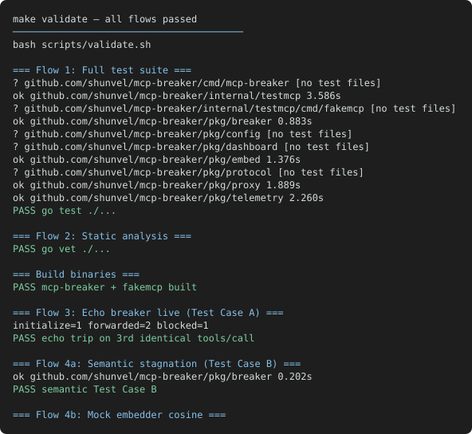

### Echo breaker — Test Case A (`make demo`)

Third identical `write_file` call blocked; first two forward as `ok`.

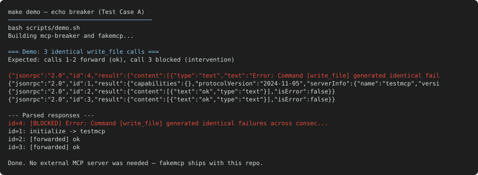

### Wrap startup — detector stack

Echo + graph ledger active; semantic enabled with `MCP_BREAKER_MOCK_EMBED=1`.

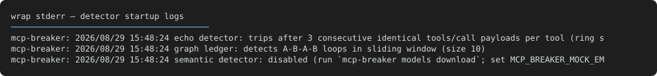

### Graph ledger — ABAB loop

Fourth `tools/call` in `write → read → write → read` pattern blocked with pause message.

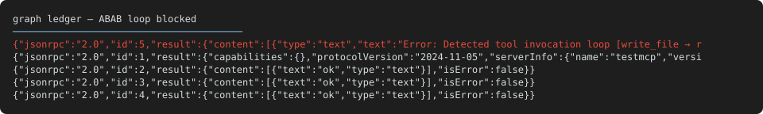

### Semantic stagnation — Test Case B

Mock embedder detects paraphrased port-8080 errors (N vs N−2 cosine ≥ 0.88).

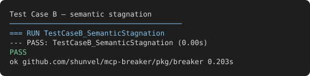

### TUI dashboard (`mcp-breaker dashboard`)

Live metrics, event stream, graph trip alert, and `[R] Resume` control during a wrap session.

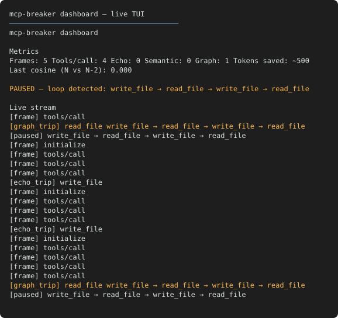

### Streamlit dev lab (`make dev-ui`)

Browser test lab at [http://localhost:8501](http://localhost:8501) — start the proxy, run canned stuck-agent scenarios, and watch results plus live dashboard metrics in one page.

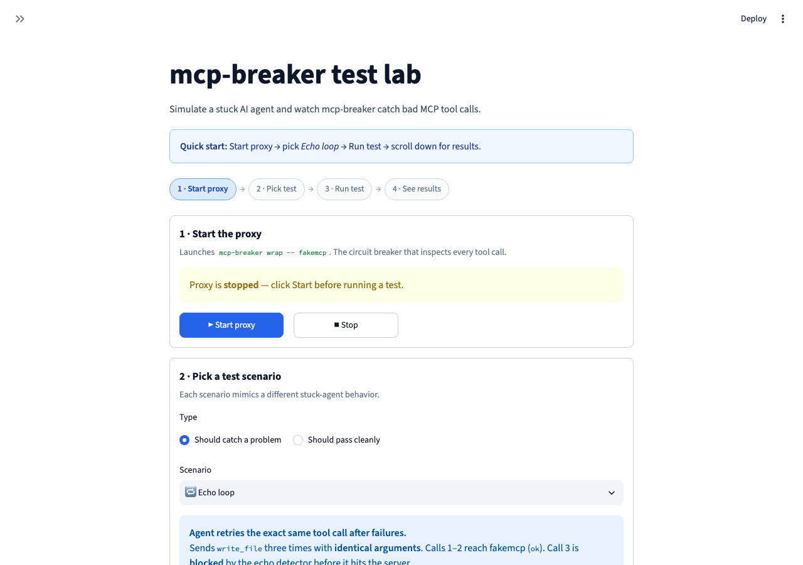

**Start proxy** — launches `mcp-breaker wrap -- fakemcp` with telemetry wired to the live dashboard panel.

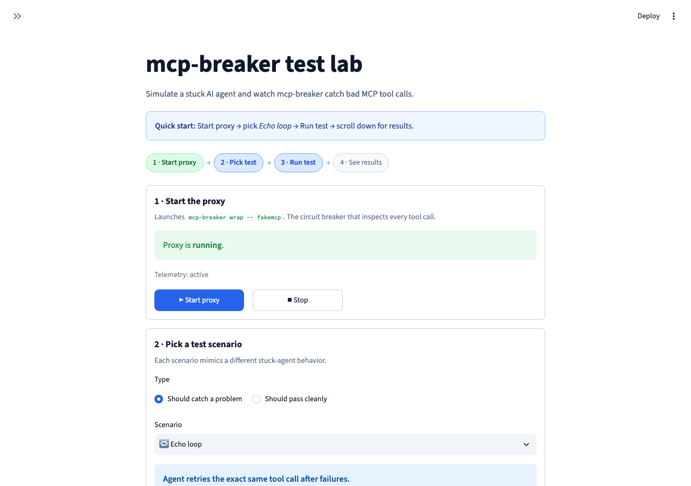

**Echo loop (Test Case A)** — calls 1–2 forward; call 3 blocked with an `ECHO BLOCK` badge in the results timeline.

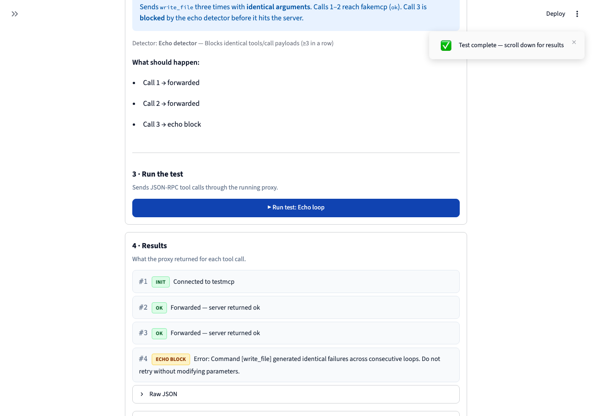

**Settings** — enable **Mock semantic embedder** for the semantic stagnation scenario (Test Case B).

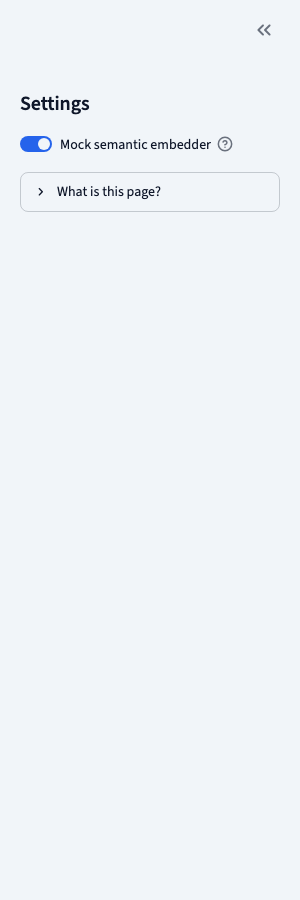

**Semantic stagnation (Test Case B)** — paraphrased port errors plus a `SEMANTIC ALERT` on turn 3.

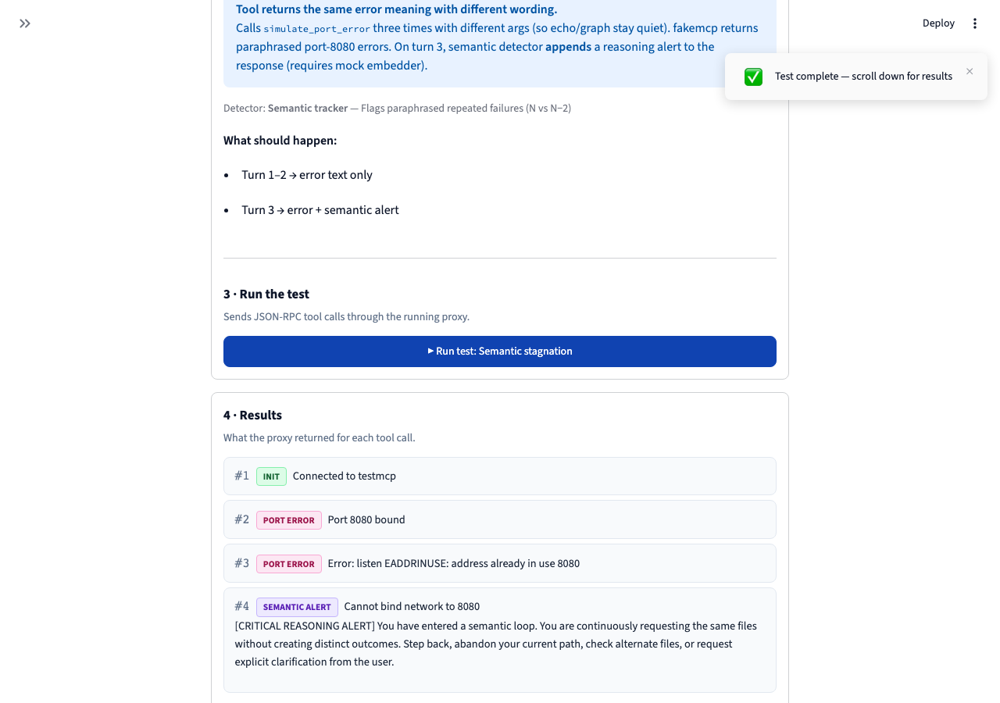

**Live dashboard** — same counters and event stream as the terminal TUI, updated after each test run.

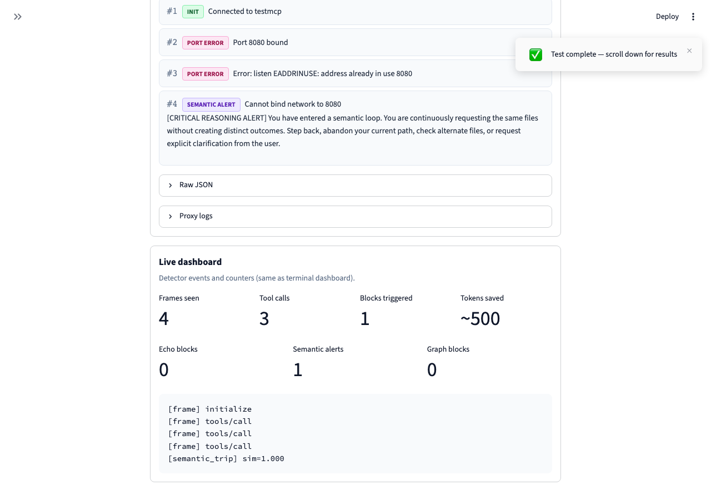

Regenerate terminal evidence after code changes:

```bash
make evidence
```

Regenerate UI screenshots (with `make dev-ui` running in another terminal):

```bash
make evidence-ui
```

### Contributing

See [CONTRIBUTING.md](CONTRIBUTING.md) for development setup, conventions, and the pull request process.

---

## Roadmap

- [x] Stdio JSON-RPC proxy with interceptor hooks
- [x] Tool parameter echo detector (spec Test Case A)
- [x] Semantic trajectory analysis with mock/ONNX embedder (spec Test Case B)
- [x] Sliding-window graph loop detection with dashboard resume
- [x] Terminal dashboard (`mcp-breaker dashboard`)
- [x] Homebrew formula and install docs
- [ ] `mcp-breaker init` — auto-rewrite client MCP configs
- [ ] Full in-process ONNX embedding pipeline (`-tags=onnx`)

---

## License

MIT License — see [LICENSE](LICENSE).

---

<p align="center">
  Built to stop agents from spinning in circles — so you can ship faster.
</p>
